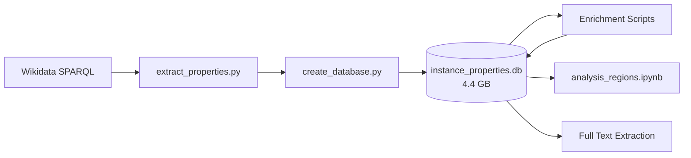

# Human Rights Defenders & Literary Works Analysis

Research project combining historical data on human rights defenders with large-scale literary works analysis from Wikidata.

## Main Database

**Location:** [`wikidata_sparql_scripts/instance_properties/output/instance_properties.db`](wikidata_sparql_scripts/instance_properties/output/instance_properties.db) (4.4 GB)

Contains ~3.8 million pre-1900 literary works extracted from Wikidata with full metadata.

---

## Pipeline Diagram



---

## Pipeline Overview

### 1. Database Creation

Scripts to extract and build the main database from Wikidata:

| Script | Location | Description |
|--------|----------|-------------|
| `extract_properties.py` | `wikidata_sparql_scripts/instance_properties/` | Main extraction script (~3.8M works) |
| `create_database.py` | `wikidata_sparql_scripts/instance_properties/` | Create SQLite database from extracted data |
| `monitor.py` | `wikidata_sparql_scripts/instance_properties/monitor_extraction/` | Monitor extraction progress |

```bash
cd wikidata_sparql_scripts/instance_properties
nohup python extract_properties.py > nohup.out 2>&1 &
python monitor_extraction/monitor.py --watch  # Monitor progress
```

---

### 2. Database Enrichment

Scripts to enrich the database with AI-powered mappings:

| Script | Location | Description |
|--------|----------|-------------|
| `enrich_countries_ai.py` | `database_consolidation/` | Map historical countries to modern equivalents |
| `enrich_language_of_work_ai.py` | `database_consolidation/` | Map languages to primary countries |
| `consolidation_dates.py` | `database_consolidation/` | Consolidate and clean date fields |
| `create_region_mapping.py` | `database_consolidation/` | Create world region classifications |
| `consolidation_places.py` | `database_consolidation/` | Consolidate place data |

---

### 3. Full Text Extraction

Scripts to extract full text content from multiple sources:

| Script | Location | Description |
|--------|----------|-------------|
| Extractors | `extract_works_full_text/extractors/` | Source-specific text extractors |
| Scripts | `extract_works_full_text/scripts/` | Batch extraction scripts |
| `viewer.html` | `extract_works_full_text/` | Web interface to view extracted texts |

**Extraction priority (waterfall):**

1. Wikisource (~36,000 works)
2. Project Gutenberg (~116 works)
3. Internet Archive (~3,000+ works)
4. Open Library (~5,200 works)
5. Gallica (~1,600 works)
6. HathiTrust
7. Direct URLs

---

### 4. Analysis

Notebooks and scripts for data analysis:

| File | Location | Description |
|------|----------|-------------|
| `analysis_regions.ipynb` | `analysis/` | Regional analysis of literary works |
| Research documents | `research_documents/` | Papers and figures |

---

## Project Structure

```
human_rights/
├── wikidata_sparql_scripts/        # DATABASE CREATION
│   └── instance_properties/
│       ├── extract_properties.py   # Main extraction script
│       ├── create_database.py      # Create SQLite database
│       ├── monitor_extraction/     # Progress monitoring
│       └── output/
│           └── instance_properties.db  # MAIN DATABASE (4.4 GB)
│
├── database_consolidation/         # DATABASE ENRICHMENT
│   ├── enrich_countries_ai.py
│   ├── enrich_language_of_work_ai.py
│   ├── consolidation_dates.py
│   ├── create_region_mapping.py
│   └── consolidation_places.py
│
├── analysis/                       # ANALYSIS NOTEBOOKS
│   └── analysis_regions.ipynb
│
├── extract_works_full_text/        # FULL TEXT EXTRACTION
│   ├── extractors/
│   ├── scripts/
│   └── viewer.html
│
├── wikisource_dump/                # Wikisource data
├── hathitrust_data/                # HathiTrust catalog
├── data/                           # Human rights defenders data
├── research_documents/             # Papers and figures
└── _archive/                       # Archived files
```

---

## Installation

```bash
# Create virtual environment
python3 -m venv .venv
source .venv/bin/activate

# Install dependencies
pip install -r requirements.txt

# For AI enrichment, set OpenAI API key
export OPENAI_API_KEY="your-key"
# Or add to .env file
```

---

## Data Sources

| Source | Coverage |
|--------|----------|
| Wikidata | ~3.8M pre-1900 works |
| Wikisource | ~36,000 works |
| Internet Archive | ~3,000+ works |
| Open Library | ~5,200 works |
| Gallica | ~1,600 works |
| Project Gutenberg | ~116 works |
| HathiTrust | Catalog data |

---

## License

MIT License
